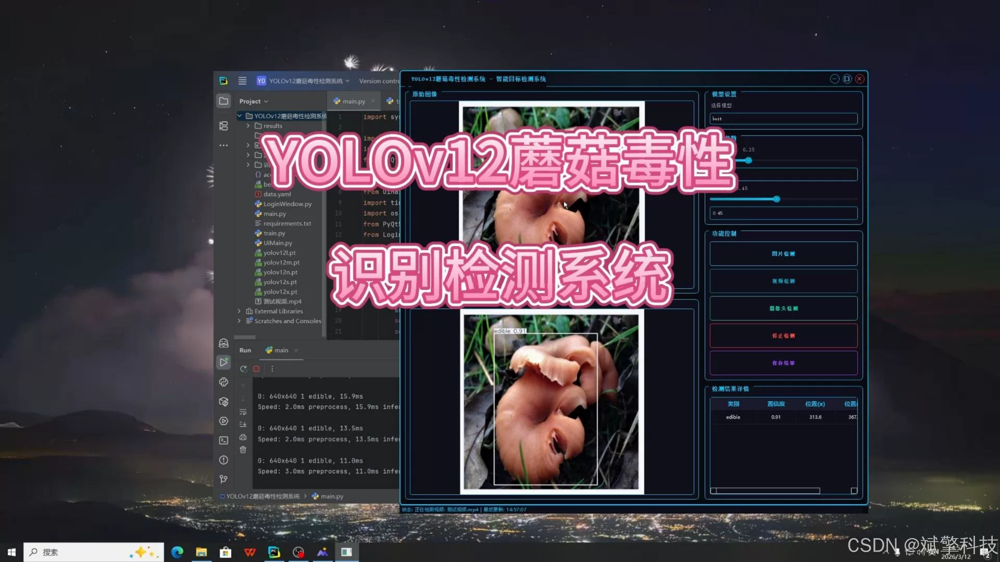
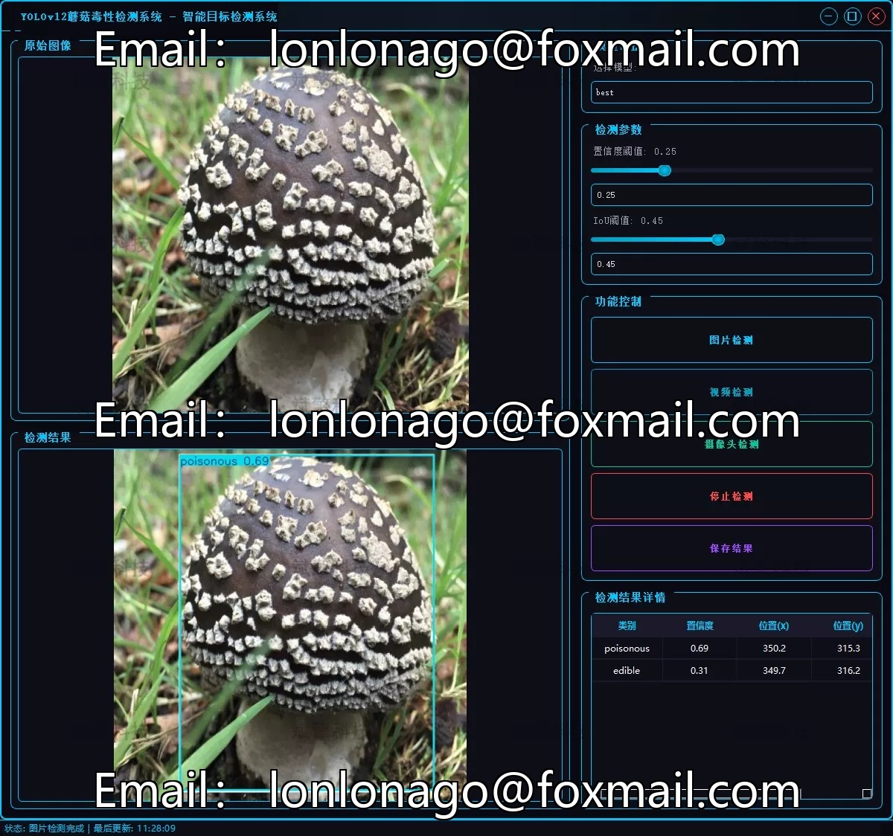
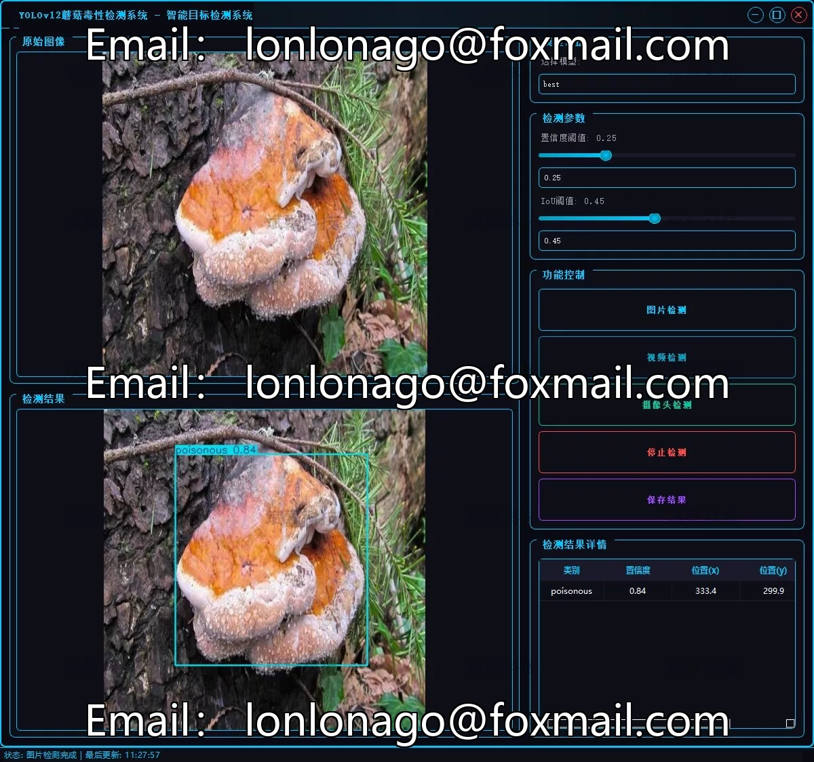
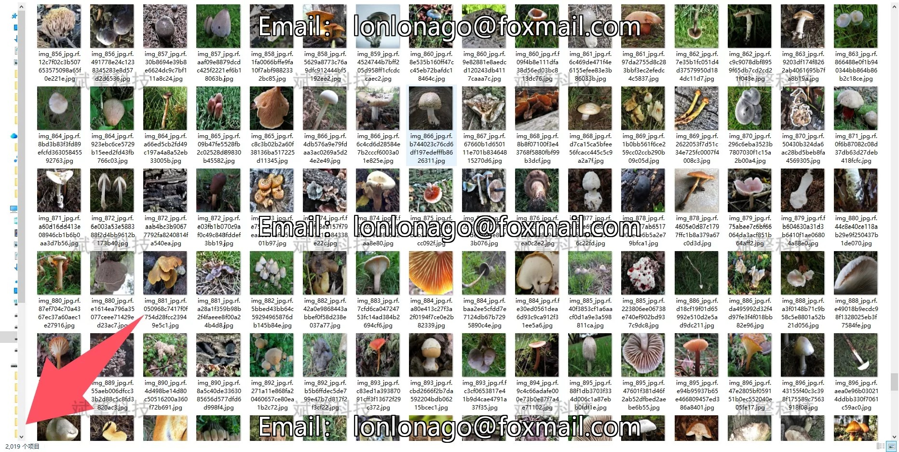
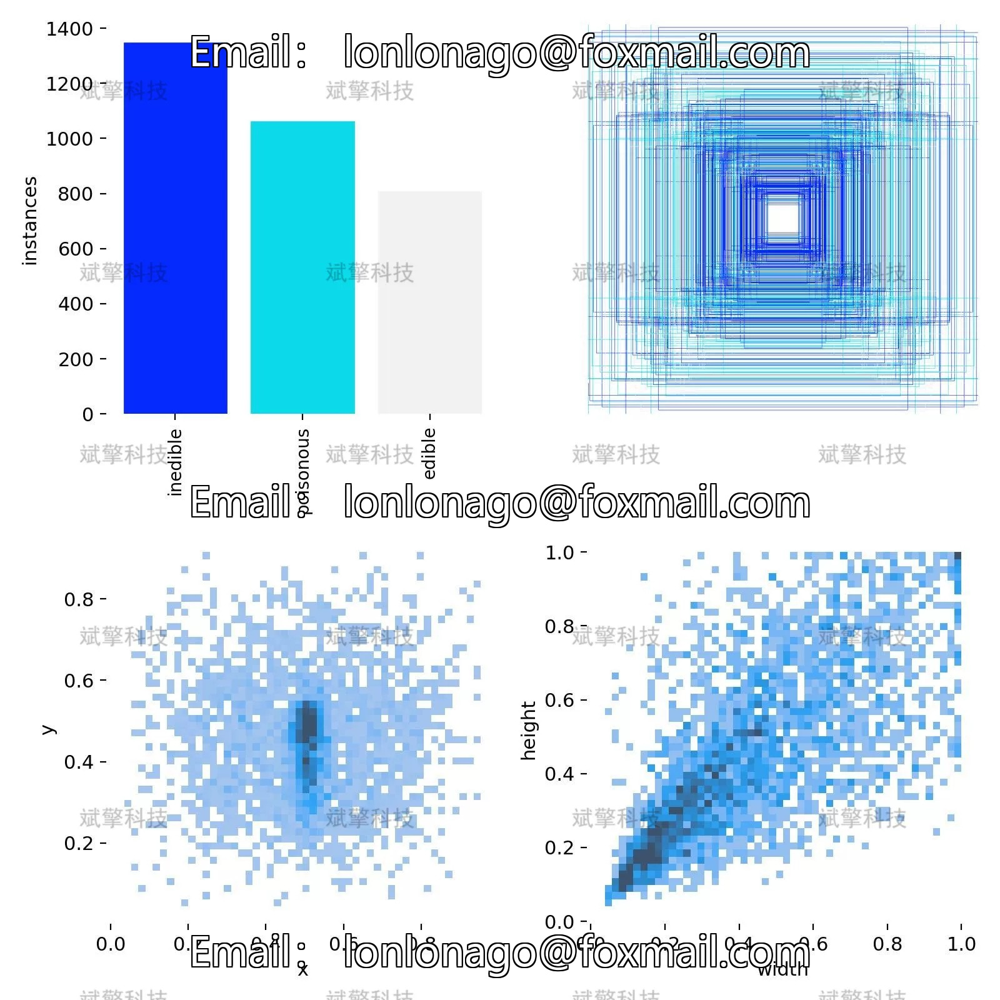
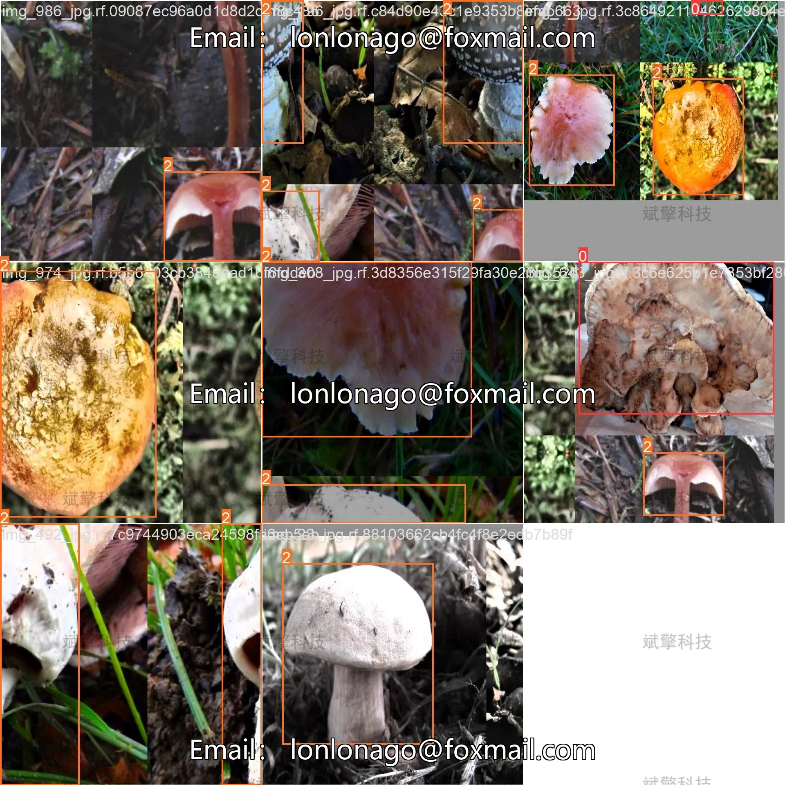
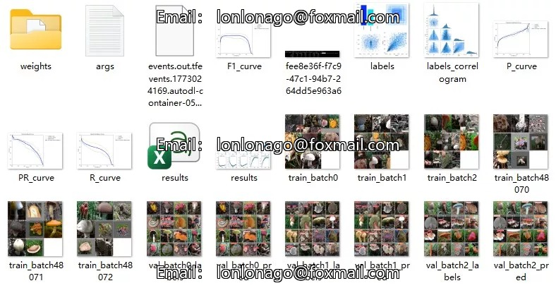
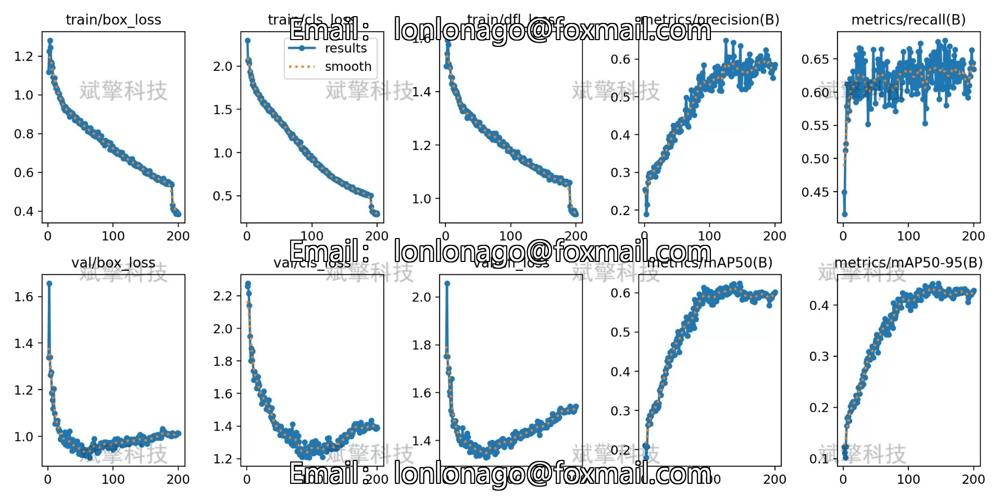
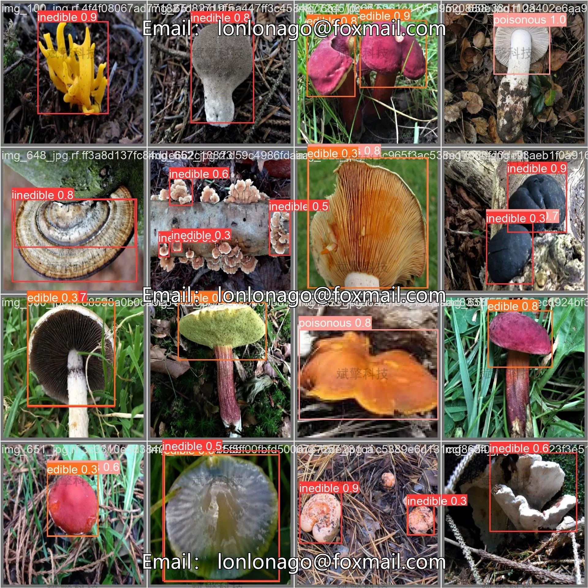

# YOLOv12 Mushroom Toxicity Detection Software Resources

## Body

YOLOv12 mushroom toxicity detection software resource sharing based on deep learning YOLOv12 mushroom toxicity detection system (YOLOv12+YOLO dataset + UI interface + login registration interface + Python project source code + model)

This project is based on the YOLOv12 deep learning target detection algorithm, and has built a high-precision, high-real-time mushroom toxicity detection system. The purpose is to solve the poisoning risk caused by eating wild mushrooms. The system targets the classification needs of mushroom toxicity, divides the detection target into three categories: inedible, poisonous, edible, and provides three core functions: static image detection, video dynamic detection, and real-time camera detection.

In practical application scenarios, users can quickly obtain toxicity classification results by uploading mushroom images, or detect each frame of wild mushroom videos, or recognize the type of mushrooms in the camera's real-time recognition. The system can output the category label, confidence and target box position of the mushrooms.

System Function Overview

✅ User Login and Signup: Supports password detection and security verification.

✅ Three detection modes: based on the YOLOv12 model, support image, video and real-time camera three detection, accurate recognition of targets.

✅ Dual-screen comparison: Display the original image and the detection result on the same screen.

✅ Data Visualization: Real-time table display of detection target categories, confidence and coordinates.

✅ Intelligent Parameter Tuning: Offers a confidence slide, dynamically optimizes detection accuracy to meet different scene requirements.

✅ Sci-fi style interactive interface: dark theme combined with dynamic light effects, reducing visual fatigue and improving operational experience.

✅ High-performance multi-thread architecture: independent detection of threads ensures smooth operation, real-time status prompts, and rapid response without lag.

Dataset Introduction

Training set: 2019 images, used for learning the core parameters of the model;
Validation set: 576 images, used for real-time validation and hyperparameter tuning during training;
Test set: 288 images, used for evaluating the final generalization ability of the model.

## Images

## Payment

Here is a pay link on Stripe ( https://buy.stripe.com/3cs8yP7sY87d0vu9AB ). Please contact me lonlonago@foxmail.com after funding $89, and I will send you a complete data files , thank you!

